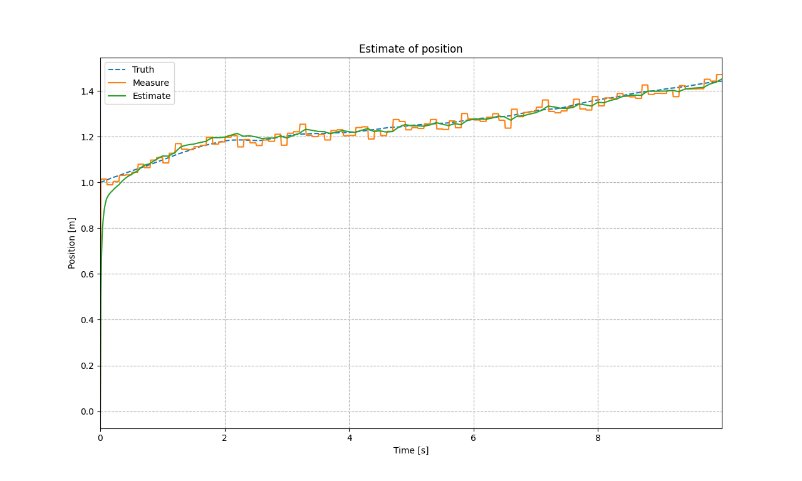

# Kalman Filter

A header-only _**Kalman Filter**_ implementation based on [Eigen3](https://gitlab.com/libeigen/eigen/-/releases/3.4.0) and [matplolib-cpp](https://github.com/HangX-Ma/matplotlib-cpp).

## Environment

- Python3.11, matplotlib-3.7.1
- Eigen-3.4.0
- matplotlib-cpp
- C++17, CMake 3.23

## Kalman filter demo

    
     
    <u>Kalman filter demo, HangX-Ma</u>
      

