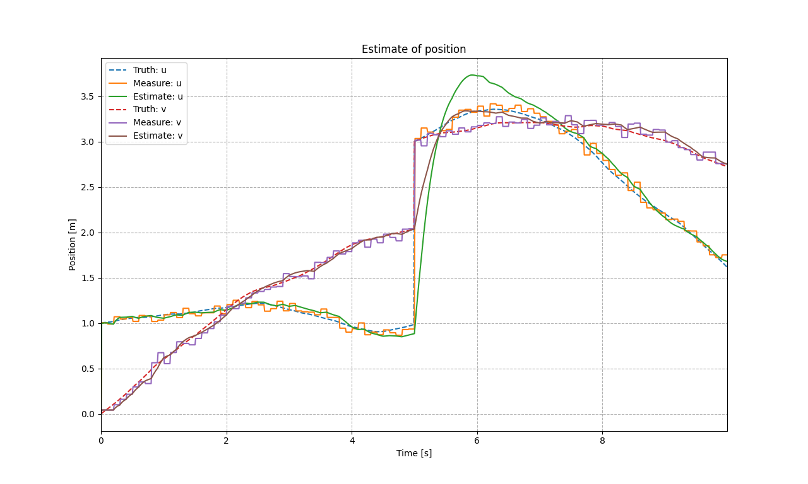

# Kalman Filter

A header-only _**Kalman Filter**_ implementation based on [Eigen3](https://gitlab.com/libeigen/eigen/-/releases/3.4.0) and [matplolib-cpp](https://github.com/HangX-Ma/matplotlib-cpp).

## Environment

- Python3.11, matplotlib-3.7.1
- Eigen-3.4.0
- matplotlib-cpp
- C++17, CMake 3.23

## Kalman Filter Demo

### Usage

Compile the project after you download this repository. You can find the output executable file in `build/bin`.

```shell
git clone https://github.com/HangX-Ma/kalman-filter.git
cd kalman-filter
cmake -B build -S .
cmake --build build
```

### Introduction

Kalam filter has the following two essential equations that describe the system's state and the measurement method.

$$
\begin{equation}
    \begin{aligned}
        x_k &= f_k(x_{k-1},w_{k-1})\\
        z_k &= h_k\left(x_k,v_k\right)
    \end{aligned}
\end{equation}
$$


The first demo is a linear model, in which the object has a constant velocity. The measured variable is `position`. The process noise is $w \sim N(0, \sigma_{p})$ and the measurement noise is $v \sim N(0, \sigma_{v})$.
$$
\begin{equation}
    \begin{bmatrix}
        p_{k+1}\\
        v_{k+1}
    \end{bmatrix}
    =
    \begin{bmatrix}
        1 & \Delta t\\
        0 & 1
    \end{bmatrix}
    \begin{bmatrix}
        p_{k}\\
        v_{k}
    \end{bmatrix}
\end{equation}
$$

$$
\begin{equation}
    z =
    \begin{bmatrix}
        1 & 0
    \end{bmatrix}
    \begin{bmatrix}
        p_{k+1}\\
        v_{k+1}
    \end{bmatrix}
\end{equation}
$$

<div align="center">
    
    <br>
    <font size="2" color="#999"><u>Kalman Filter: Linear model, HangX-Ma</u></font>
    <br></br>
</div>

The second demo simulate a pedestrian's movement on coordination `u` and `v` (or `x` and `y`). The difference with the previous case is that this case take pedestrian's potential acceleration into account. But the acceleration is included in process noise. This case realize the idea from [this site](https://blog.csdn.net/luteresa/article/details/104226258).

<div align="center">
    
    <br>
    <font size="2" color="#999"><u>Kalman Filter: Linear model with acceleration noise, HangX-Ma</u></font>
    <br></br>
</div>

## License

MIT License
